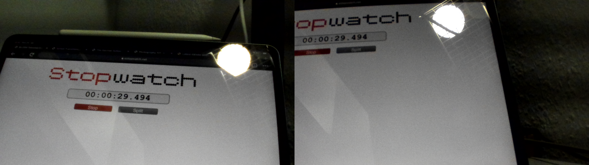

# Results

1. 2 Cameras, 1920x1080@**10fps**, exposure 5ms --> Perfectly synced
   
   
   
2. 2 Cameras, 1920x1080@**20fps**, exposure 5ms --> Perfectly synced
   
   
   
3. 2 Cameras, 1920x1080@**25fps**, exposure 5ms --> Perfectly synced
   
   
   
4. **3** Cameras, 1920x1080@25fps, exposure 5ms --> Perfectly synced but there are duplicated frames like frame 10 and 11 as shown below
   
   
   
   
5. 3 Cameras, **3840x2160**@25fps, exposure 5ms --> Perfectly synced but there are duplicated frames
   
   
   
   
   
